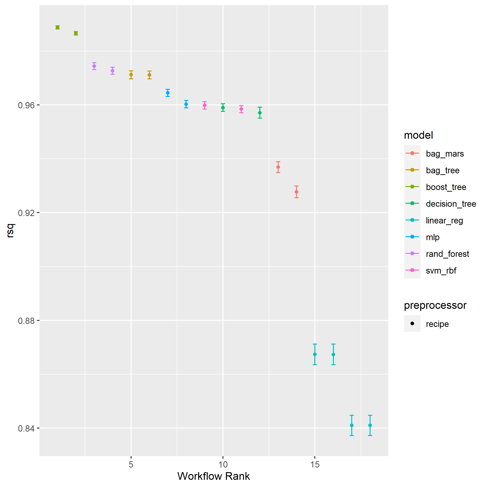
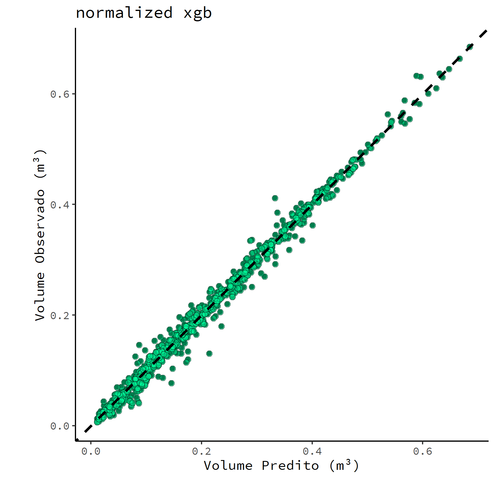

```{r, echo=FALSE, fig.cap="Workflow do trabalho."}
knitr::include_graphics("D:/Projetos/GitHub/blog/_posts/2021-10-20-predizendo-volume-de-eucalipto-com-tidymodels-xgboost-e-targets/featured.jpg")

```


```{r setup, include=FALSE}
knitr::opts_chunk$set(echo = TRUE)
```

Umas das dificuldades encontradas na academia é a reprodutibilidade de trabalhos. Essa é uma situação que, infelizmente, é corriqueira na área florestal. Neste texto, apresento algumas ferramentas que buscam melhorar a forma que trabalhos podem ser replicados, como a utilização dos pacotes here e renv.   
Aproveitando o embalo, também mostro como usar o pacote tidymodels para a predição do volume de eucalipto. O dataset utilizado neste projeto é oriundo do excelente [trabalho](https://journals.plos.org/plosone/article?id=10.1371/journal.pone.0238703) publicado no ano de 2020 pelo professor Gileno Azevedo juntamente com outros pesquisadores. O dataset pode ser encontrado na página do artigo.   Vamos lá!

## 1ª etapa - Iniciando o projeto

Antes de qualquer coisa, preciso falar de 3 ferramentas básicas quando se busca reprodutibilidade em trabalhos no R:   

* renv  
Este pacote é um gerenciador de dependências: ele organiza e "memoriza" as dependências (como pacotes) que o seu projeto está usando de modo que, caso alguém refaça suas análises, não ocorra problemas como o uso de pacotes de versões distintas, além de tornar seu ambiente de trabalho isolado. Mais à frente explicarei outra importante vantagem. Caso queira saber mais sobre o renv, esse tutorial do [Chaoran](https://6chaoran.wordpress.com/2020/07/20/introduction-of-renv-package/) é show.
* R Projects  
É o mais simples dessa lista. Basicamente toda vez que você for criar um projeto, o ideal é que seja criada uma pasta principal e dentro dela serão criadas as demais pastas (data, R, etc.). Em seguida, abra o RStudio e crie um Project dentro desta pasta principal. A organização destas pastas terá a seguinte estrutura (a mesma utilizada neste trabalho):  


```{r eval=FALSE}
# Eucalipto_Volume (pasta principal)  
#      |--Eucalipto_Volume.Rproj
#      |--R  
#      |--plots
#      |--report
```
   
* here  
Esse aqui é o mais legal: basicamente ele te permite criar caminhos relativos. Por ex.: ao invés de se referir a um arquivo como `dados <- C:user/zezin/uma/duas/dados/meus_dados.csv`, ou usar `setwd("C:user/zezin/uma/duas/dados")`, prefira salvar seu Project em uma pasta principal e se referir a ele como `here::here("dados", "meus_dados.csv")`. Isso facilita que outras pessoas reproduza suas análises sem grandes problemas. Tem um pessoal que recomenda [fortemente](https://twitter.com/jennybryan/status/940436177219338240) usar o pacote here. Basicamente ele define o caminho de acesso aos arquivos a partir da última pasta do caminho (top-level folder), que no nosso exemplo hipotético é a pasta "dados".  

### Mão na massa

A primeira coisa que fiz foi criar uma pasta principal. Em seguida, criei dentro dela um R Project com o nome do meu projeto (Eucalipto_Volume). Então instalei o renv e executei o comando `renv::init()` para criar um ambiente local do projeto. A partir daí, iniciei as análises e instalei os pacotes básicos iniciais necessários (incluindo o here). Sempre que instalava um novo pacote, chamava `renv::snapshot()` para atualizar os estado do projeto e as dependências. Caso fosse necessário reverter alguma alteração de dependência no projeto após chamar `renv::snapshot()`, era acionado o comando `renv::restore(`). Pronto! Meu ambiente local do projeto está montado e isolado. Bacana, né?  


## 2ª etapa - Modelagem
Agora a parte legal: a modelagem dos dados! Recentemente tem ganhado bastante tração um pacote de modelagem do R baseado na filosofia do tidyverse: o [tidymodels](https://www.tidymodels.org/). Esse pacote é incrível, permitindo usar diversos modelos de machine learning de forma extremamente intuitiva e bem elegante. A seguir vou mostrar o passo a passo necessário para ajustar e testar diversos modelos visando a predição do volume de eucalipto.


Carregando os pacotes necessários:

```{r eval = FALSE}
library(here)
library(tidyverse)
library(tidymodels)
library(janitor)
library(EnvStats)
library(bestNormalize)
library(finetune)
library(doParallel)
library(extrafont)

```

### Aquisição dos dados  

Primeiramente serão adquiridas as bases de dados (treino e teste) a serem utilizadas no projeto a partir do site que disponibiliza o artigo e os dados. Aqui será criada uma pasta "data" onde os arquivos da base de dados serão baixados.  

```{r eval = FALSE}

# Criando o diretório onde a base será alocada
dir.create("data")

# Acesso ao material
link_train <- "https://doi.org/10.1371/journal.pone.0238703.s007"
link_test <- "https://doi.org/10.1371/journal.pone.0238703.s008"

# Aqui é criado o caminho de acesso às bases de dados
dest_folder_train <- here::here("data", "train.xlsx")
dest_folder_test <- here::here("data", "test.xlsx")

# Aquisição da base de teste e treino usadas pelos autores do trabalho
utils::download.file(link_train, 
                     destfile = dest_folder_train, 
                     mode = "wb")

utils::download.file(link_test, 
                     destfile = dest_folder_test, 
                     mode = "wb")

```

Perceba que aqui é usado o pacote here para a criação de um caminho relativo até a pasta de destino, em que o caminho até a pasta objetivo (neste caso, a pasta "data") se inicia a partir da pasta principal criada para o projeto (Eucalipto_Volume), e não do seu diretório base. Caso a pasta principal do projeto seja alterada para outra partição, não será necessário chamar `setwd()` com um novo caminho.  
E qual a vantagem disso? Isso permite que você ou qualquer outra pessoa não precise alterar o caminho caso queira carregar/salvar as informações obtidas das mesmas análises aqui apresentadas. A utilização desse pacote é uma boa prática quando falamos de project-oriented workflows (workflow montado tendo como base projects).  

### Preparando os dados  
As bases de dados foram separadas originalmente pelos autores em dois arquivos. Essa é uma boa prática para criação de modelos e sua subsequente avaliação. Dividir os sets dessa forma permite que não ocorra data leakage (quando seu modelo, na fase de treino, "entra em contato" com os dados de teste, causando overfitting). Entretanto, uma vantagem do tidymodels é que ele permite o split entre set de treino e set de teste de forma unificada, sendo geradas partições de um mesmo arquivo sem a ocorrência de data leakage. Para ilustrar essa capacidade, os datasets serão unidos e então será mostrado como realizar a sua separação em treino e teste com o tidymodels:

```{r eval = FALSE}
# Carregando a base de daoos separada
sheet_train <- readxl::read_excel(here::here("data", "train.xlsx"), 
                                  skip = 1)
sheet_test <- readxl::read_excel(here::here("data", "test.xlsx"), 
                                 skip = 1)

# Unificando a base e "limpando os nomes" das colunas
dataset <- 
    dplyr::bind_rows(sheet_train, sheet_test) |>
    janitor::clean_names() |> 
    dplyr::mutate(across(c(stem:rotation), 
                         forcats::as_factor),
                  across(c(tx, d), as.integer))

```

### Iniciando o processo de modelagem
Após unificar os dados, vamos colocar a mão na massa!
A primeira coisa a ser feita é dividir os dados em treino e teste e então realizar a reamostragem repetida do set de treino para validação dos modelos. O tidymodels faz isso de forma prática:

```{r eval = FALSE}

set.seed(1504)

vol_split <- rsample::initial_split(data = dataset, 
                                    prop = 0.75, 
                                    strata = cod_volume)
train_split <- rsample::training(vol_split)
test_split <- rsample::testing(vol_split)

# Realizando validação cruzada repetida para avaliação dos modelos
vol_folds <- rsample::vfold_cv(data = train_split, 
                               strata = cod_volume, 
                               repeats = 5)

```

Algumas considerações nessa etapa:  

* O split inicial foi realizado usando uma proporção de 3/4.  
* A divisão foi estratificada de acordo com as classes de volume comercial.  
* O tidymodels permite a divisão do dataset de forma simples e que não ocorra data leakage, dispensando a necessidade de separar os dados manualmente.

### Explorando os dados
Neste caso, temos um set de dados com poucos preditores: dbh (DAP) e h (Altura). Neste dataset também constam as variáveis tx e d que dizem respeito a se o volume de madeira predito é com casca ou sem casca (0 ou 1) e o diâmetro comercial, respectivamente. De modo a observar os padrões dos dados, vamos fazer uma análise exploratória básica das variáveis:

```{r eval=FALSE}

ggplot(data = train_split) +
    geom_density(mapping = aes(x = dbh)) +
    labs(x = "DAP")

ggplot(data = train_split) +
    geom_density(mapping = aes(x = h)) +
    labs(x = "Altura")

# Explorando as relações entre as variáveis principais
ggplot(data = train_split) +
    stat_count(mapping = aes(x = cod_volume))

ggplot(data = train_split) +
    geom_point(mapping = aes(x = dbh, y = v))

ggplot(data = train_split) +
    geom_point(mapping = aes(x = dbh^2, y = v))

ggplot(data = train_split) +
    geom_point(mapping = aes(x = h^2, y = v))

ggplot(data = train_split) +
    geom_point(mapping = aes(x = h, y = v))

ggplot(data = train_split) +
    geom_point(mapping = aes(x = dbh*h, y = v))

ggplot(data = train_split) +
    geom_point(mapping = aes(x = (dbh*h)^2, y = v))

ggplot(data = train_split) +
    geom_point(mapping = aes(x = dbh, y = h))

```


Neste caso, é recomendável normalizar os dados antes de seguir com a modelagem. Sem a padronização, uma variável pode ter um maior [impacto](https://stats.stackexchange.com/questions/29781/when-conducting-multiple-regression-when-should-you-center-your-predictor-varia) sobre a resposta apenas por conta da sua escala, o que pode ser o caso aqui dadas as próprias unidades (cm e m) dos dados Essa normalização será aplicada mais à frente na modelagem.  
Pode-se perceber também que a adição de interações e de termos quadráticos tornam a relação entre os preditores, especificamente dap e h, mais linear.  
Também é possível observar que as classes de volume não possuem a mesma quantidade de observações. Neste caso, pode-se seguir com duas estratégias: a primeira seria ajustar um modelo para cada um dos diferentes volumes em separado; a segunda consiste na divisão ponderada (estratificação) no split dos dados (o treino e o teste teriam a mesma proporção de cada classe de volume). Neste trabalho, seguiremos a segunda estratégia.


### Ajustando os modelos
Agora vem a parte onde a mágica do tidymodels acontece:
Primeiro é definida uma recipe do passo-a-passo que os dados devem ser processados. Em seguida são definidas as especificações modelos a serem utilizados. Serão definidas duas recipes (receitas de passo-a-passo): uma sem pré-processamento e outra pré-processada (com adião de interações, termos quadráticos e normalização):

```{r eval=FALSE}
# Definindo os pré-processamentos dos dados
simple_vol_rec <- recipes::recipe(v ~ dbh + h + tx + d, data = train_split)

normalized_vol_rec <- simple_vol_rec |> 
  recipes::step_interact(terms = ~ dbh:h) |>  
  recipes::step_mutate(dbh_sqrd = dbh^2, 
                       h_sqrd = h^2) |> 
  recipes::step_normalize(recipes::all_predictors(), -tx, -d)

```

Aqui pode-se perceber que a recipe `normalized_vol_rec` é apenas a recipe `simple_vol_rec` com mais "passos" adicionados.  

Em seguida, são definidos os diversos modelos a serem ajustados e depois testados. Estes modelos terão os hiperparâmetros mais importantes "marcados" para tunagem usando a função tune::tune. 

```{r eval=FALSE}
# Definindo diversos modelos
lm_mod <- 
     parsnip::linear_reg() |> 
     parsnip::set_engine("lm") |> 
     parsnip::set_mode("regression")
  
penalized_lm_mod <- 
  parsnip::linear_reg(penalty = tune::tune(),
                      mixture = tune::tune()) |> 
  parsnip::set_engine("glmnet") |>
  parsnip::set_mode("regression")

bag_mars_mod <- 
  baguette::bag_mars(prod_degree = tune::tune(), 
                     prune_method = "exhaustive",
                     num_terms = tune::tune()) |> 
  parsnip::set_engine("earth", times = 4) |> 
  parsnip::set_mode("regression")
  
dec_tree <- 
  parsnip::decision_tree(cost_complexity = tune::tune(),
                         tree_depth = tune::tune(),
                         min_n = tune::tune()) |> 
  parsnip::set_engine("rpart") |> 
  parsnip::set_mode("regression")

bag_cart_mod <- 
  baguette::bag_tree(cost_complexity = tune::tune(),
                     tree_depth = tune::tune(),
                     min_n = tune::tune()) |> 
  parsnip::set_engine("rpart", times = 50L) |>
  parsnip::set_mode("regression")

rf_spec <- 
  parsnip::rand_forest(mtry = tune::tune(), 
                       min_n = tune::tune(),
                       trees = 1000) |> 
  parsnip::set_engine("ranger") |> 
  parsnip::set_mode("regression")
  
xgb_spec <- 
  parsnip::boost_tree(tree_depth = tune::tune(),
                      learn_rate = tune::tune(),
                      loss_reduction = tune::tune(),
                      min_n = tune::tune(),
                      sample_size = tune::tune(),
                      mtry = tune::tune(),
                      trees = 1000,
                      stop_iter = 20) |> 
  parsnip::set_engine("xgboost") |> 
  parsnip::set_mode("regression")
  
svm_r_spec <- 
  parsnip::svm_rbf(cost = tune::tune(),
                   rbf_sigma = tune::tune(),
                   margin = tune::tune()) |> 
    parsnip::set_engine("kernlab") |> 
    parsnip::set_mode("regression")
  
nnet_spec <- 
  parsnip::mlp(hidden_units = tune::tune(),
               penalty = tune::tune(), 
               epochs = tune::tune()) |> 
    parsnip::set_engine("nnet") |> 
    parsnip::set_mode("regression")
  
  
specs_vol <- list("linear_reg" = lm_mod, 
                  "bag_mars"= bag_mars_mod,
                  "decision_tree" = dec_tree, 
                  "bag_cart" = bag_cart_mod, 
                  "rf" = rf_spec, 
                  "xgb" = xgb_spec,
                  "svm_rbf" = svm_r_spec, 
                  "nnet_mlp" = nnet_spec,
                  "penalized_reg" = penalized_lm_mod)


```

Todas as especificações foram alocadas em uma lista que será usada mais à frente. Até aqui temos as duas recipes de pré-processamento a serem usadas nos dados e os 9 modelos especificados a serem tunados/ajustados.  

Agora vem a pergunta: como juntar tudo isso?  
Em um workflow (ou um workflowset, melhor dizendo).

```{r eval=FALSE}

# Definindo o workflowset (serão ajustados 18 modelos ao todo)
wflow_vol <- workflowsets::workflow_set(
  models = specs_vol, #lista de modelos
  preproc = list(
    normalized = normalized_vol_rec,
    simple = simple_vol_rec)
  )

```

Criado o workflowset, então será definida a configuração e o tipo de tunagem a ser aplicada. Neste caso, o processo de tunagem usado (race tuning) avalia todos os modelos em um set inicial da reamostragem. Baseado na performance corrente das métricas, alguns parâmetros que produzem modelos ruins, do ponto de vista preditivo, são então descartados na sequência do processo. Mais sobre esse processo de tunagem pode ser encontrado no livro do [tidymodels](https://www.tmwr.org/grid-search.html#racing).

```{r eval=FALSE}
# Definindo as configurações da tunagem de parâmetros usando computação paralela
racing_ctrl <- finetune::control_race(
  save_pred = TRUE,
  parallel_over = "everything",
  save_workflow = TRUE
)


# Definindo a execução em paralelo 
clusters <- parallel::detectCores()
cl <- parallel::makePSOCKcluster(clusters)
doParallel::registerDoParallel(cl)

# Realizando a tunagem dos modelos
results_vol <-
  workflowsets::workflow_map(
    wflow_vol,
    seed = 1504,
    resamples = vol_folds,
    control = racing_ctrl,
    fn = "tune_race_anova",
    grid = 25,
    metrics = yardstick::metric_set(yardstick::rmse,
                                    yardstick::rsq, 
                                    yardstick::huber_loss, 
                                    yardstick::mae)
)
# Parando a execução em paralelo 
parallel::stopCluster(cl)
foreach::registerDoSEQ()

```

Após realização da tunagem e escolhida a melhor configuração de parâmetros dos modelos de melhor desempenho, é feita a avaliação usando gráficos de acordo com as métricas definidas:

```{r eval=FALSE}
# Plotagem dos resultados para cada métrica utilizada
plot_results <- function(race_rslts, mtrc = "rmse",...){
  workflowsets::autoplot(
    race_rslts,
    rank_metric = mtrc,  
    metric = mtrc,       
    select_best = TRUE,
    ...
    ) -> plot_racing
  
  ggplot2::ggsave(glue::glue(mtrc, ".png"), 
                  path = here::here("plots"))
  graphics::plot(plot_racing)
  
}

plot_results(results_vol, mtrc = "rsq")
plot_results(results_vol, mtrc = "rmse")
plot_results(results_vol, mtrc = "huber_loss")
plot_results(results_vol, mtrc = "mae")

```

### Avaliação da qualidade dos modelos

Em seguida, deve ser realizada a seleção do melhor modelo. Para isso, são criadas funções de:  

* Seleção do melhor modelo.
* Ajuste final do modelo selecionado.  
* Obtenção das métricas de avaliação do modelo selecionado no set de teste.

```{r eval=FALSE}
# Função para seleção de modelos de acordo com o R² (padrão)
select_models <- function(grid_results, metric = "rsq", rank_posit = 1){
  
  workflowsets::rank_results(grid_results, 
                             select_best = TRUE) |> 
  dplyr::relocate(rank) |> 
  dplyr::select(-c(.config, model, std_err)) |> 
  dplyr::filter(.metric == "rsq" & rank == rank_posit) -> model_selected
  EnvStats::print(model_selected)
  
}

# Função para ajuste final do modelo
fit_model <- function(grid_results, model_ranked, df_split, metric = "rmse"){
    
    name_model <- model_ranked |> purrr::pluck("wflow_id", 1)
  
    model <- grid_results |> 
        workflowsets::extract_workflow_set_result(id = name_model) |>
        tune::select_best(metric = metric)
    
    grid_results |> 
        workflowsets::extract_workflow(name_model) |>
        tune::finalize_workflow(model) |> 
        tune::last_fit(split = df_split,
                       metrics = yardstick::metric_set(yardstick::rmse, 
                                                       yardstick::rsq, 
                                                       yardstick::huber_loss, 
                                                       yardstick::mae))
    
}

# Função para obtenção da performance do melhor modelo no set de teste
metrics_mod <- function(best_mod, model_ranked){
  
  name_model <- model_ranked |> purrr::pluck("wflow_id", 1)
  
  workflowsets::collect_metrics(best_mod) |> 
    kableExtra::kbl(caption = glue::glue("Performance do modelo ", 
                                         name_model)) |> 
    kableExtra::kable_classic(full_width = F, 
                              html_font = "Cambria", 
                              font_size = 16) |> 
    kableExtra::save_kable(file = here::here("plots", 
                                             glue::glue("perf_", 
                                                        name_model, 
                                                        ".png")),
                           self_contained = T)
  
  workflowsets::collect_metrics(best_mod)
}

# Seleção, ajuste e avaliação do melhor modelo
best_model <- select_models(grid_results = results_vol)

fit_best_mod <- fit_model(grid_results = results_vol,
                        model_ranked = best_model,
                        df_split = vol_split)

metrics_mod(fit_best_mod, best_model)

```




De modo a termos um ponto de comparação didático, serão comparados um modelo de qualidade intermediária e o melhor modelo. Esse processo se dá de forma similar ao realizado previamente, exceto que agora será selecionado o modelo ranqueado na posição número 10 (rank_posit = 1) em contraste ao melhor modelo (rank_posit = 1):  

```{r eval=FALSE}
# Seleção, ajuste e avaliação do modelo intermediário
intermediary_model <- select_models(grid_results = results_vol, rank_posit = 10)

fit_intermediary_model <- fit_model(grid_results = results_vol,
                                       model_ranked = intermediary_model,
                                       df_split = vol_split)

metrics_mod(fit_intermediary_model, intermediary_model)

```

Agora ambos os modelos ajustados previamente serão comparados através de gráficos de dispersão contendo o volume predito vs volume observado, permitindo uma análise visual da qualidade preditiva de cada um. Para isso serão definidas duas funções para geração do gráfico de dispersão de cada modelo.

```{r eval=FALSE}
# Função para plotar os resultados dos modelos
scatterplot <- function(.x, .y){
    
    ggplot2::ggplot(.x) + 
        ggplot2::geom_point(mapping = ggplot2::aes(x = .pred, y = v)) + 
        ggplot2::geom_point(mapping = ggplot2::aes(x = .pred, y = v), 
                   alpha = 0.5, 
                   size = 2, 
                   color = "black", 
                   fill = "mediumspringgreen", 
                   pch = 21) + 
        ggplot2::geom_abline(lty = 2, 
                    col = "black", 
                    size = 1) +
        tune::coord_obs_pred() +
        ggplot2::theme_classic() +
        ggplot2::theme(text = ggplot2::element_text(family = "Source Code Pro")) +
        ggplot2::ggtitle(.y) +
        ggplot2::labs(x = "Volume Predito (m³)",
                      y = "Volume Observado (m³)") -> plot_scatterplot
    
  ggplot2::ggsave(glue::glue(.y, ".png"), path = here::here("plots"))
  graphics::plot(plot_scatterplot)
  
}

# Função para extrair os dados preditos e plotá-los vs os 
# dados observados usando a função anterior
accessing_models <- function(mod1, mod2, model_ranked1, model_ranked2){
    
    gsub_und <- function(x) gsub("_", " ", x)
    name_model1 <- model_ranked1 |> purrr::pluck("wflow_id", 1) |> gsub_und()
    name_model2 <- model_ranked2 |> purrr::pluck("wflow_id", 1) |> gsub_und()
    
    workflowsets::collect_predictions(mod1) |> 
        dplyr::mutate(model = name_model1) |> 
        dplyr::bind_rows(workflowsets::collect_predictions(mod2) |> 
                      dplyr::mutate(model = name_model2)) |>
        tidyr::nest(data = -c(model)) |> 
        dplyr::mutate(plots = map2(data, model, scatterplot))
    
}

accessing_models(fit_best_mod, 
                 fit_intermediary_model, 
                 best_model, 
                 intermediary_model)

```



### Conclusão da modelagem
É possível observar que o modelo XGBoost com pré-processamento normalizado apresentou um desempenho elevado frente aos demais modelos,
apontando a sua aplicabilidade para a predição de volume de madeira de eucalipto em florestas plantadas. É digno de nota que, de forma similar ao que foi apontado por Azevedo et al. (2020), o modelo de redes neurais artificiais (MLP) apresentou um R² de ~0,96.  


## 3ª etapa - Reprodutibilidade
Agora vamos para etapa que foca no uso do pacote targets. Com o targets pode ser mantido uma rotina de trabalho reprodutível que evita ao máximo repetições. O pacote "aprende" como o seu fluxo de trabalho se encaixa e pula a execução de tarefas pesadas que já estão atualizadas. Desse modo, ele executa apenas as etapas necessárias ou que foram alteradas/adicionadas. Mais informações sobre esse pacote podem ser encontradas em seu [manual](https://books.ropensci.org/targets).  
  
**E como o targets funciona?**  
  
Basicamente ele depende de funções:  
Para todas as etapas da modelagem que foi realizada foi criada uma função que foi alocada em um script (functions.R), assim, o fluxo de trabalho é subdividido e pode rodar de forma mais independente. Lembra da pasta "Eucalipto_Volume/R" criada lá no começo? Então, dentro dessa pasta é onde está o script com as funções definidas. Esse script pode ser acessado [aqui](https://github.com/TheilonMacedo/Eucalipto_Volume/blob/main/R/functions.R). Um exemplo de função criada para a modelagem foi a da criação da base de dados na pasta "data":  


```{r eval=FALSE}

readind_data <- function(){
    
    dir.create("data")
    
    link_train <- "https://doi.org/10.1371/journal.pone.0238703.s007"
    link_test <- "https://doi.org/10.1371/journal.pone.0238703.s008"
    
    dest_folder_train <- here::here("data", "train.xlsx")
    dest_folder_test <- here::here("data", "test.xlsx")
    
    utils::download.file(link_train, 
                         destfile = dest_folder_train, 
                         mode = "wb") # wb se OS for Windows
    utils::download.file(link_test, 
                         destfile = dest_folder_test, 
                         mode = "wb")
    
    sheet_train <- readxl::read_excel(dest_folder_train, skip = 1)
    sheet_test <- readxl::read_excel(dest_folder_test, skip = 1)
    
    dplyr::bind_rows(sheet_train, sheet_test) |> 
        janitor::clean_names() |>  
        dplyr::mutate(across(c(stem:rotation), 
                             forcats::as_factor),
                      across(c(tx, d), as.integer))
    
}

```

As demais funções seguem esse mesmo estilo.  

### Usando o targets
É agora que o targets entra na brincadeira de vez. Para orquestrar o fluxo de trabalho primeiramente deve ser criado um script (_targets.R) alocado dentro da pasta principal ("Eucalipto_Volume"). Neste script são carregados os pacotes targets e tarchetypes (falo dele mais à frente), também é deve ser carregado o script com as funções definidas na etapa anterior e alocado na pasta "R", a partir da função base::source() (perceba o uso do pacote here):  

```{r eval=FALSE}

library(targets)
library(tarchetypes)
source(here::here("R", "functions.R"))

```

Em seguida, deve ser criada uma lista tendo os targets como elementos usando a função targets::tar_targets() em que o seu primeiro argumento é o nome do target a ser criado e o segundo é a função do script "functions.R" a ser usada, no seguinte esquema:  

```{r eval=FALSE}

list(targets::tar_target(nome_do_target_1, funcao_a_ser_executada()), # 1
     targets::tar_target(nome_do_target_2, funcao_a_ser_executada(nome_do_target_1))) # 2

```

A função usada dentro do targets::tar_targets() geralmente requer como argumento o nome do target anterior, como no caso 2. Entretanto, targets que iniciam o fluxo de trabalho (caso 1) ou que não estão ligadas diretamente aos produtos intermediários da computação não requerem que seja passado algum argumento à sua função.  

Neste trabalho, a lista completa de targets definidos de acordo com as funções pode ser observada a seguir:  

```{r eval=FALSE}

list(
    targets::tar_target(packages, packages_used()),
    targets::tar_target(dataset, readind_data()),
    targets::tar_target(vol_split, split_data(dataset, 1504, 0.75, cod_volume)),
    targets::tar_target(test_split, test_set_split(vol_split)),
    targets::tar_target(train_split, train_set_split(vol_split)),
    targets::tar_target(vol_resamples, kfold_cv(train_split, strata = cod_volume, repeats = 5)),
    targets::tar_target(normalized_vol_rec, preproc_rec(train_split)),
    targets::tar_target(simple_vol_rec, simple_rec(train_split)),
    targets::tar_target(all_specs, def_specs()),
    targets::tar_target(wflow_vol, workflow_config(all_specs, normalized_vol_rec, simple_vol_rec)),
    targets::tar_target(racing_ctrl, racing_defs()),
    targets::tar_target(results_vol, race_tuning(wflow_vol, vol_resamples, racing_ctrl, 1504)),
    targets::tar_target(plot_rsq, plot_results(results_vol, "rsq")),
    targets::tar_target(best_model, select_models(results_vol, "rmse", 1)),
    targets::tar_target(intermediary_model, select_models(results_vol, "rmse", 10)),
    targets::tar_target(fit_best_mod, fit_model(results_vol, best_model, vol_split)),
    targets::tar_target(fit_intermediary_model, fit_model(results_vol, intermediary_model, vol_split)),
    targets::tar_target(metrics_best, metrics_mod(fit_best_mod, best_model)),
    targets::tar_target(metrics_intermediary, metrics_mod(fit_intermediary_model, intermediary_model)),
    targets::tar_target(model_comparison, accessing_models(fit_best_mod,
                                                           fit_intermediary_model, 
                                                           best_model, 
                                                           intermediary_model)),
    tarchetypes::tar_render(report, here::here("report", "report.Rmd"))
)

```

Essa lista possui alguns pontos dignos de destaque:   

1. O targets possui algumas ferramentas de avaliação do fluxo de trabalho estabelecido, e uma das mais legais é a função `targets::tar_visnetwork`. Ela permite que o pipeline seja inspecionado a partir de um fluxograma que informa se os targets estão atualizados ou não. 


  
2. Ao fim da lista, o target `tarchetypes::tar_render` permite que um relatório seja gerado a partir de um arquivo ".Rmd". Assim, foi produzido um relatório simples, usando rmardown, visando ser uma amostra do que pode ser feito a partir desse orquestramento de trabalho. Esse exemplo pode ser expandido para a produção de um artigo acadêmico ou um relatório mais complexo. Dessa forma, pode-se realizar as análises do trabalho e gerar o material final em um único pipeline. No corpo do relatório produzido, foram adicionados chamados aos 3 penúltimos objetos da lista de targets (metrics_best, metrics_intermediary, model_comparison) usando a função `targets::tar_read()`, em que estes objetos targets são lidos dentro do relatório. Isso é necessário para que a função `tarchetypes::tar_render` saiba que o relatório só poderá ser produzido quando todas as análises do pipeline forém finalizadas e estes três últimos objetos gerados.   

3. Outro ponto digno de nota é que esse processamento pode levar um tempo para ser computado. Com isso, rodá-lo novamente pode ser bem tedioso. Uma vantagem do targets é que ele memoriza os passos realizados e guarda os produtos obtidos. Dessa forma, caso seja realizada alguma alteração no pipeline, ele roda apenas as análises diretamente afetadas pela alteração feita. Por exemplo: caso seja adicionado um novo modelo na função `def_specs()`, que consta no arquivo `functions.R`, todas as análises diretamente afetadas por esse passo serão computadas novamente, porém os passos anteriores ao seu chamado não são recomputados, reduzindo o tempo e otimizando o trabalho.   

### Reproduzindo o pipeline
Após realização da modelagem e orquestramento do trabalho, resta a sua publicação para que outras pessoas possam reproduzi-lo. Isso é feito de uma forma bem simples graças ao renv e ao targets. Basta clonar o repositório e salvá-lo em uma pasta principal, preferencialmente. Então, basta abrir o arquivo R Project (Eucalipto_Volume.Rproj) no RStudio e executar os seguintes comandos para instalar todos os pacotes necessários e rodar o pipeline, respectivamente:   

```{r eval=FALSE}

renv::restore() # Pode demorar um pouco
targets::tar_make() # Roda o pipeline

```

Caso você queira inspecionar o pipeline, para acompanhar o processo ou onde possa ter ocorrido possíveis falhas, basta chamar:   


```{r eval=FALSE}

targets::tar_visnetwork() # Apresenta o diagrama de execução

```

## Conclusão (UFA!)
Essa foi uma introdução (espero que não muito cansativa) à uma das formas de utilização de modelos de machine learning com o tidymodels e de como aumentar a reprodutibilidade de trabalhos com os pacotes here, renv e targets. Confesso que esse projeto foi um trabalho bem bacana de realizar e utilizar estes pacotes se mostrou uma experiência super enriquecedora.  
Agradeço quem chegou até o final. Até mais!    


## Referências

Azevedo, G. B. et al. Multi-volume modeling of Eucalyptus trees using regression and artificial neural networks. Plos one, v. 15, n. 9, p. e0238703, 2020.

Kuhn, M., Silge, J., 2021. Tidy Modeling with R. URL: https://www.tmwr.org/
