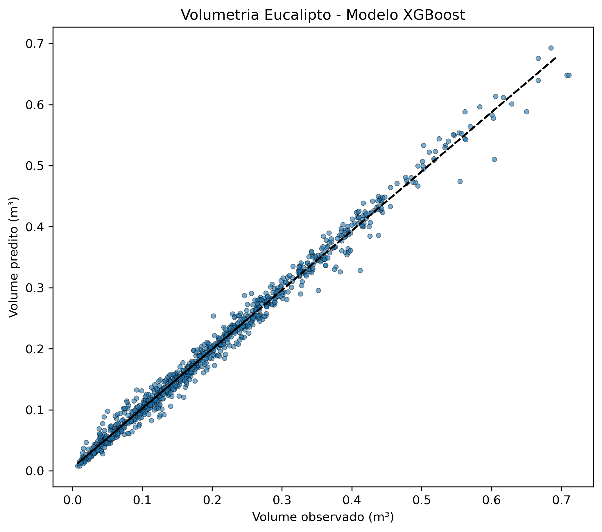

```{r setup, include=FALSE, }
knitr::opts_chunk$set(echo = TRUE)
```

No último [texto](https://theilonmacedo.netlify.app/posts/2021-10-20-predizendo-volume-de-eucalipto-com-tidymodels-xgboost-e-targets/) que escrevi, o XGBoost foi o melhor modelo ajustado dentre todos os que foram testados. Um colega que leu o texto me solicitou um auxílio para ajustar este modelo usando Python, já que essa é a linguagem que ele possui maior domínio. Então decidi aproveitar e escrever um breve tutorial sobre esse ajuste.   

O dataset aqui utilizado é oriundo do excelente trabalho publicado publicado por [Azevedo et al. (2020)](https://journals.plos.org/plosone/article?id=10.1371/journal.pone.0238703).

### Aprendendo com os erros  
XGBoost (eXtreme Gradient Boosting) é uma implementação eficiente do algoritmo gradient boosted trees. Este algoritmo é um dos mais usados atualmente dada a sua elevada capacidade preditiva, além de ter como ponto forte a sua escalabilidade em diversos cenários.  
De forma geral, os algoritmos gradient boosting atuam de modo a predizer uma variável resposta a partir da combinação de estimativas de um set de modelos fracos.  
O processo de treinamento desses modelos se dá de forma iterativa, em que são adicionada novas árvores de decisão que tem o objetivo de predizer os resíduos das árvores estabelecidas previamente, "aprendendo" com erros das árvores ajustadas anteriormente. São chamados de gradient boosting models por usarem o algoritmo de gradiente descendente para minimizar a função de perda. Mais informações sobre esses algoritmos podem ser encontradas [aqui](https://docs.aws.amazon.com/sagemaker/latest/dg/xgboost-HowItWorks.html), [aqui](https://arxiv.org/pdf/1603.02754.pdf), [aqui](https://www.analyticsvidhya.com/blog/2018/09/an-end-to-end-guide-to-understand-the-math-behind-xgboost/) e [aqui](https://web.stanford.edu/~hastie/ISLR2/ISLRv2_website.pdf).  

### Ajustando o modelo

Importando as bibliotecas necessárias:  

```{python eval=FALSE}
from xgboost import XGBRegressor
from sklearn import metrics
from sklearn.model_selection import train_test_split
import pandas as pd
import matplotlib.pyplot as plt
import numpy as np
import pickle

```

Neste caso, o dataset já estava particionado. Porém, optei por realizar a sua unificação de modo a seguir o padrão estipulado no texto anterior.  


```{python eval=FALSE}

training = pd.read_excel('data/train.xlsx', skiprows=1)
testing = pd.read_excel('data/test.xlsx', skiprows=1)

df = training.append(testing)

X = df.filter(items=["DBH", "H", "TX", "d"]).values.reshape(-1, 4)
y = df.filter(items=["V"])

```

Particionando os dados em treino e teste com estratificação de acordo com o volume comercial:  


```{python eval=FALSE}

X_train, X_test, y_train, y_test = train_test_split(X, y, 
                                                    test_size=0.25, 
                                                    random_state=1504,
                                                    stratify=df.Cod_Volume)


```

Em seguida, defini o modelo e seus hiperparâmetros. Optei por não realizar a tunagem destes hiperparâmetros e usar os valores já definidos no último tutorial:  


```{python eval=FALSE}

model = XGBRegressor(
    objective='reg:squarederror',
    n_estimators=2000,
    max_depth=7,
    learning_rate=0.0367,
    n_jobs=10,
    gamma=0.0000806,
    booster="gbtree",
    min_child_weight=20
    )

```

Feita esta estapa, resta ajustar o modelo com os dados de treino:  

```{python eval=FALSE}

model.fit(X_train, y_train)

```

Realizado o ajuste, agora será realizada a predição dos dados de teste para comparação e avaliação da qualidade do modelo:  

```{python eval=FALSE}

predicted_vol = model.predict(X_test)

# Avaliação da qualidade do modelo usando o R²
print("Coeficiente de determinação - R²:", metrics.r2_score(y_test, predicted_vol))

```
O modelo apresentou um R² bastante elevado, indicando potencial de uso para a predição do volume de eucalipto.  
Obtendo uma apresentação visual dos resultados do volume predito com o modelo XGBoost e observado em campo:  

```{python eval=FALSE}

plt.figure(figsize=(8, 7), dpi=300)
plt.scatter(model_results["actual"], 
            model_results["predicted"],
            s=15, 
            edgecolors='black', 
            linewidth=0.4, 
            alpha=0.6)
plt.title("Volumetria Eucalipto - Modelo XGBoost")
plt.xlabel("Volume observado (m³)")
plt.ylabel("Volume predito (m³)")
z = np.polyfit(model_results["actual"], 
               model_results["predicted"], 
               1)
p = np.poly1d(z)
plt.plot(model_results["predicted"], 
         p(model_results["predicted"]), 
         "r--", 
         color="black")

```

{width=100%}

Como podemo concluir que o modelo generaliza bem, basta ajustá-lo usando toda a base de dados:  

```{python eval=FALSE}

model.fit(X, y)

```

Pronto! Agora basta escolher a melhor forma de salvar seu modelo seja usando pickle ou joblib (papo para outro texto).  

### Referências

Azevedo, G. B. et al. Multi-volume modeling of Eucalyptus trees using regression and artificial neural networks. Plos one, v. 15, n. 9, p. e0238703, 2020.  

https://estatsite.com.br/2020/10/03/xgboost-em-python/

James, G. et al. An introduction to statistical learning. New York: springer, 2013.  

https://xgboost.readthedocs.io/en/latest/


