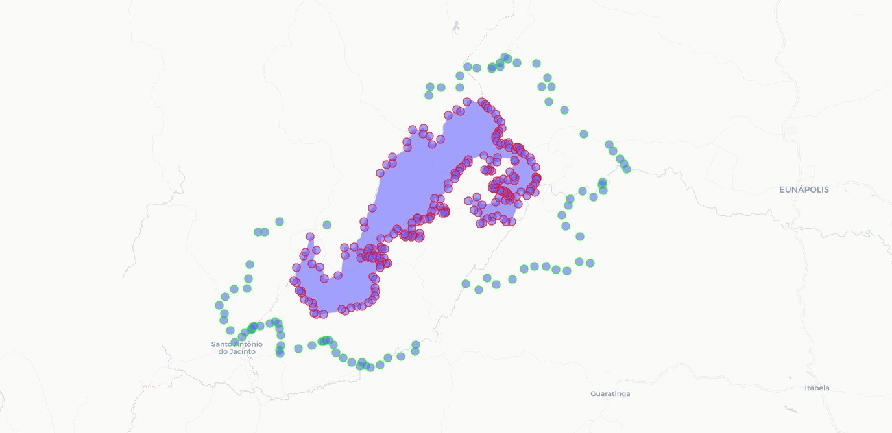

```{r setup, include=FALSE}
knitr::opts_chunk$set(echo = FALSE)
```


### Obtendo as coordenadas

No fim do último ano, recebi uma demanda para obter o perímetro das áreas de uma Unidade de Conservação (UC) localizada na região Sul da Bahia para verificação de possíveis sobreposições com locais a serem licenciados.  
Quem lida com dados geoespaciais de UCs sabe que essa é uma tarefa relativamente simples. Porém, também foi solicitado o perímetro da Zona de Amortecimento (ZA) desse local. Aí que tivemos uma complicação, pois não pude achar nenhum material em formato vetorial com esse limite. A saída foi obter o [decreto](https://www.planalto.gov.br/ccivil_03/_ato2007-2010/2010/dnn/dnn12640.htm) de criação dessa UC e extrair os dados de posicionamento. E aí foi que o barraco desabou: eram mais de duas centenas de coordenadas. Extrair essa quantidade manualmente seria complexo e foi então que decidi usar o R.  

### Requisitos para extração de dados

Para fazer essa obtenção, organização e plotagem de dados a partir do texto do decreto em formato PDF foram necessárias algumas bibliotecas:  

```{r eval=FALSE, echo=TRUE}

library(tidyverse) # conjunto de libs para manipulação de dados
library(here) # lib para definir tornar a obtenção de arquivos mias fácil
library(pdftools) # lib para ler o texto do .pdf
library(data.table) # lib para tabelar as coordenadas
library(sf) # lib para manipular arquivos vetorias
library(mapview) # lib para plotar os dados em um mapa interativo
```

### Extraindo os dados

A aquisição de dados foi feita inicialmente com a leitura do arquivo e obtenção de 4 páginas de texto usando a lib {pdftools}:

```{r eval=FALSE, echo=TRUE}

decreto <- pdftools::pdf_text(here("decreto", "decreto.pdf"))


```

Em seguida, foi criada uma função `get_coords` usando expressões regulares (regex) para obtenção de partes do texto que seguisse o seguinte padrão:  

1 - obter valores que começam com 8, seguido de uma série de números e possuem mais 6 digitos (lat)  
2 - obter valores que começam com 3 ou 4, seguido de uma série de números e possuem mais 5 digitos (long)  

A função ainda realiza a obtenção das coordenadas a partir de um índice (`index`) e as converte em valores numéricos, em seguida as salvando em uma coluna de tibble (tabela) que será unificada:  


```{r eval=FALSE, echo=TRUE}

get_coords <- function(pdf, index){
  long <- tibble(long = str_extract_all(pdf, "8[0-9]{6}")[[index]] %>% as.numeric())
  
  lat <- tibble(lat = str_extract_all(pdf, "[3-4][0-9]{5}")[[index]] %>% as.numeric()) %>% 
    filter(lat != 409448 & lat != 400074)
  
  long %>% bind_cols(lat)
  
}

```

Então a função foi aplicada sobre as 4 páginas de texto obtidas usando a função `map` e as 4 tibbles obtidas então foram unificadas em uma única datatable com a função `rbindlist`. Em seguida, foi adicionada a coluna `id` contendo o número de cada linha da data.table.  
Como a leitura das páginas foi feita de forma geral, foi necessário identificar qual base de dados correspondia às coordenadas da UC e qual correspondia às da ZA, para isso o documento foi avaliado e foi identificada que a quebra acontecia na coordenada de número 224. Após a separação das séries de coordenadas, foi percebido que um dos pontos do perímetro da Zona de Amortecimento tinha um erro de digitação. Então esse erro teve de ser corrigido de forma manual, sendo a coordenada adicionada à tabela de pontos:  


```{r eval=FALSE, echo=TRUE}

1:4 %>% 
  purrr::map(get_coords, pdf = decreto) %>%
  data.table::rbindlist() -> my_df

my_df <- my_df %>% 
  mutate(id = 1:nrow(my_df))

my_df %>% filter(lat == 390724)

my_df_uc <- my_df %>% 
  filter(id < 224) %>% 
  select(-id)

my_df_za <- my_df %>% 
  filter(id >= 224) %>% 
  select(-id) %>% 
  bind_rows(c(long = 8181041, lat = 409448))
```

### Plotagem dos dados

Agora vem a parte divertida da coisa: plotagem e análise visual. Assim, primeiro foi definido o sistema de projeção dos pontos a serem usados (Sirgas 2000 UTM Zone 24S). Em seguida as tabelas de pontos foram convertidas em objetos `sf` (simple feature) para facilitar a sua manipulaçção e plotagem pela lib {sf}. Então, para comparar os dados, foi carregado o arquivo .shp oficial da UC em questão e feita a sua reprojeção espacial. Por fim, as três feições (pontos da UC, ZA e a área oficial da UC) foram unificadas em uma lista e plotadas em um mapa interativo usando a lib {mapview}:


```{r eval=FALSE, echo=TRUE}

proj <- "+proj=utm +zone=24 +south +ellps=aust_SA +towgs84=-57,1,-41,0,0,0,0 +units=m +no_defs"

points_uc <- st_as_sf(x = my_df_uc, 
                   coords = c("lat", "long"), 
                   crs = proj)

points_za <- st_as_sf(x = my_df_za, 
                      coords = c("lat", "long"), 
                      crs = proj)

area_uc <- read_sf(here("ucs", "ucstodas.shp")) %>% 
  filter(NOME_UC1 == "PARQUE NACIONAL DO ALTO CARIRI") %>% 
  st_transform(crs = st_crs(proj))

mapview(list(points_uc, points_za, area_uc), color = c("red", "green", "white"))
```

  

### Conclusão
Essa foi uma abordagem simples e que nos poupou bastante tempo. Espero que este material possa servir de apoio a pessoas que encontrem os mesmos desafios que tive. Até a próxima!  