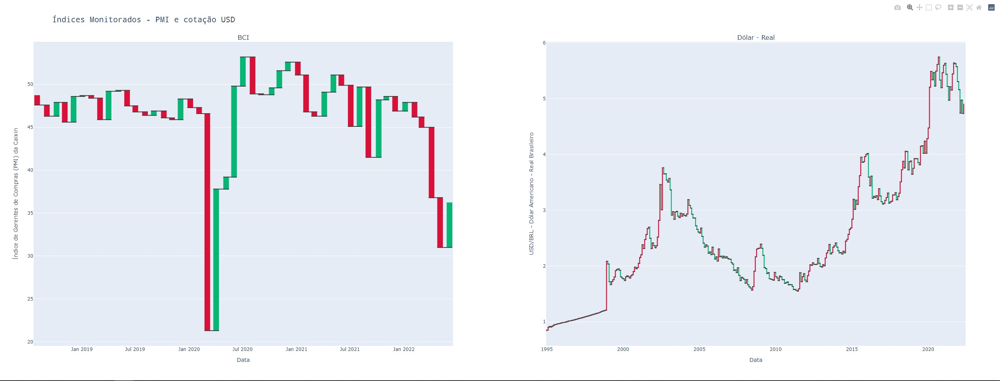

Este tutorial descreve as etapas necessárias para a aquisição de dados, geração de gráficos e envio de notificação via Telegram de forma automatizada usando Python e Heroku.   

# Etapa 1
A pasta de trabalho foi organizada usando a seguinte estrutura:   

```
.
├── Procfile
├── README.rst
├── pyproject.toml
├── requirements.txt
├── runtime.txt
├── setup.sh
├── src
│   └── de_project
│       ├── __init__.py
│       ├── get_table_pmi.py
│       ├── load_data.py
│       ├── main.py
│       ├── plots_monitor.py
│       ├── send_msg.py
│       └── usd_brl.py
└── tests
    ├── __init__.py
    └── test_de_project.py  

```

Mais à frente descrevo as funções de cada arquivo nesta pasta. Por enquanto, explicarei o código dos arquivos `get_table_pmi.py` e e `usd_brl.py`. A ideia de dividir o código em módulos foi para facilitar a sua organização e manutenção. Começando pelo módulo `get_table_pmi.py`, a ideia aqui é a obtenção de uma base de dados relativa ao Índice de atividade dos gerentes de compras (PMI) Serviços Caixin que funciona como um termômetro da economia chinesa a nível mensal. Para isso foi utilizada a biblioteca Selenium de modo a acessar a página e obter a raspar a base de dados. A ideia é que este código rode no background de um servidor virtual em um serviço na nuvem (Heroku). Alguns Key Insights dessa etapa são:  

- O tratamento da base de dados necessária após a sua aquisição na url definida;  
- O salvamento dessa base utilizando a lib sqlalchemy de modo a termos uma database de tamanho diminuto e acesso rápido;  
- A utilização de Logging para informativos acerca da execução do programa.  


```{python eval=FALSE, echo=TRUE}

# get_table_pmi.py
from time import sleep


def get_data_pmi():
    import logging
    import os
    import re
    import time

    import arrow
    import numpy as np
    import pandas as pd
    from selenium import webdriver
    from selenium.webdriver.chrome.options import Options
    from selenium.webdriver.chrome.service import Service
    from selenium.webdriver.common.by import By
    from selenium.webdriver.support import expected_conditions as EC
    from selenium.webdriver.support.ui import WebDriverWait
    from sqlalchemy import create_engine
    from webdriver_manager.chrome import ChromeDriverManager

    logging.basicConfig(format="%(levelname)s - %(message)s", level=logging.DEBUG)

    logging.info("Starting to perform data collection...")

    INVESTING_PAGE_URL = (
        "https://www.investing.com/economic-calendar/chinese-caixin-services-pmi-596"
    )

    options = Options()
    options.binary_location = os.environ.get("GOOGLE_CHROME_BIN")
    options.add_argument("--headless")
    options.add_argument("--no-sandbox")
    options.add_argument("--disable-dev-shm-usage")
    options.add_argument("window-size=1400x800")
    options.add_argument("--disable-gpu")
    options.add_argument("--remote-debugging-port=9222")
    options.add_argument("start-maximized")
    print("Teste")
    driver = webdriver.Chrome(
        service=Service(ChromeDriverManager().install()), options=options
    )
    driver.get(INVESTING_PAGE_URL)
    time.sleep(10)


    logging.info("Getting PMI values...")

    for i in range(20):
        WebDriverWait(driver, 10).until(
            EC.element_to_be_clickable((By.XPATH, '//*[@id="showMoreHistory596"]/a'))
        ).click()
        time.sleep(2)

    body = driver.find_elements(By.CSS_SELECTOR, "#eventHistoryTable596 > tbody")
    for i in body:
        get = pd.Series(i.text)

    driver.close()
    driver.quit()

    logging.info("Starting data storing process...")

    def split_in_date(text):
        return re.split(r"((?:0?[1-9][0-2]):[0-5][0-9])", text)

    values_list = [split_in_date(i) for i in list(get[0].split("\n"))]

    month_list = [
        "(Jan)",
        "(Feb)",
        "(Mar)",
        "(Apr)",
        "(May)",
        "(Jun)",
        "(Jul)",
        "(Aug)",
        "(Sep)",
        "(Oct)",
        "(Nov)",
        "(Dec)",
    ]

    month_replacement = {i: "" for i in month_list}

    def replace_all(text, dic):
        for i, j in dic.items():
            text = text.replace(i, j)
            string_1 = text.strip()
            string_2 = arrow.get(string_1, "MMM DD, YYYY").format("YYYY-MM-DD")
        return string_2

    date = [replace_all(i[0], month_replacement) for i in values_list]
    close = [i[1] for i in values_list]
    time_data = pd.DataFrame({"date": date, "close": close})

    logging.info("Time data acquired...")

    def get_pmi_values(record_list, col_names):
        pmi_values = [
            i[2].replace("   ", " NaN ").strip().split(" ") for i in record_list
        ]
        df = pd.DataFrame()
        for i, k in enumerate(col_names):
            vals = [j[i] for j in pmi_values]
            df[k] = vals
        return df

    numeric_cols = ["actual", "forecast", "previous"]

    price_data = get_pmi_values(values_list, numeric_cols)

    logging.info("PMI values acquired. Storing data...")

    final_data = pd.concat([time_data, price_data], axis=1)

    final_data[numeric_cols] = (
        final_data[numeric_cols].replace("NaN", np.NaN).apply(pd.to_numeric)
    )

    disk_engine = create_engine("sqlite:///pmi.db")

    def write_to_disk(df):
        df.to_sql("pmi", disk_engine, if_exists="append", index=False)

    write_to_disk(final_data)

    logging.info("Data stored successfully.")
    sleep(10)


```


Também foi obtida uma base de dados da cotação mensal histórica do dólra frente ao real. O código segue a mesma linha da base obtida anteriormente, porém com algumas peculiaridades:  

- Nessa base de dados foi necessário acesso à page do site investing.com usando login e senha (armazenadas como variáveis de ambiente);  
- Foi necessário também a inserção de campos de filtragem da base de dados a ser apresentada, como a data do período analisado;  
- Foi necessário um tratamento de dados de forma mais complexa, principalmente pelo fato da coluna de `Data` possuir um formato peculiar (`MMM AAA`).  
Perceba que ambas as bases foram estruturadas dentro de funções.  


```{python eval=FALSE, echo=TRUE}

#usd_brl.py

def get_data_usd_brl():
    import logging
    import os
    import time
    from datetime import date
    from typing import List

    import pandas as pd
    import unidecode
    from dotenv import load_dotenv
    from selenium import webdriver
    from selenium.webdriver.chrome.options import Options
    from selenium.webdriver.chrome.service import Service
    from selenium.webdriver.common.by import By
    from selenium.webdriver.support import expected_conditions as EC
    from selenium.webdriver.support.ui import Select, WebDriverWait
    from sqlalchemy import create_engine
    from webdriver_manager.chrome import ChromeDriverManager

    logging.basicConfig(format="%(levelname)s - %(message)s", level=logging.DEBUG)

    logging.info("Starting to perform data collection...")

    load_dotenv()
    SENHA = os.environ.get("Senha")
    EMAIL = os.environ.get("Email")
    INVESTING_PAGE_URL = "https://br.investing.com/currencies/usd-brl-historical-data"

    options = Options()
    options.binary_location = os.environ.get("GOOGLE_CHROME_BIN")
    options.add_argument("--headless")
    options.add_argument("--no-sandbox")
    options.add_argument("--disable-dev-shm-usage")
    options.add_argument("window-size=1400x800")
    options.add_argument("--disable-gpu")
    options.add_argument("--remote-debugging-port=9222")
    options.add_argument("start-maximized")
    logging.info("Webdriver iniciando")
    driver = webdriver.Chrome(
        service=Service(ChromeDriverManager().install()), options=options
    )

    driver.get(INVESTING_PAGE_URL)
    time.sleep(10)

    WebDriverWait(driver, 20).until(
        EC.element_to_be_clickable((By.XPATH, '//*[@id="userAccount"]/div/a[1]'))
    ).click()
    time.sleep(5)

    input_element = driver.find_element_by_xpath('//*[@id="loginFormUser_email"]')
    input_element.send_keys(EMAIL)
    input_element = driver.find_element_by_xpath('//*[@id="loginForm_password"]')
    input_element.send_keys(SENHA)

    WebDriverWait(driver, 20).until(
        EC.element_to_be_clickable((By.XPATH, '//*[@id="signup"]/a'))
    ).click()
    time.sleep(20)

    select = Select(driver.find_element_by_xpath('//*[@id="data_interval"]'))
    select.select_by_visible_text("Mensal")

    WebDriverWait(driver, 5).until(
        EC.element_to_be_clickable((By.XPATH, '//*[@id="widgetFieldDateRange"]'))
    ).click()
    time.sleep(5)

    input_element = driver.find_element_by_xpath('//*[@id="startDate"]')
    input_element.clear()
    input_element.send_keys("31/12/1994")

    today = date.today()
    d1 = today.strftime("%d/%m/%Y")
    input_element = driver.find_element_by_xpath('//*[@id="endDate"]')
    input_element.clear()
    input_element.send_keys(d1)

    WebDriverWait(driver, 5).until(
        EC.element_to_be_clickable((By.XPATH, '//*[@id="applyBtn"]'))
    ).click()
    time.sleep(5)

    body = driver.find_elements(By.CSS_SELECTOR, "#curr_table")
    for i in body:
        get = pd.Series(i.text)

    driver.close()
    driver.quit()

    logging.info("Starting data storing process...")

    names = get[0].split("\n")[0].split(" ")
    headers = [unidecode.unidecode(i) for i in names]

    def join_str(pd_series: pd.Series) -> List[List[str]]:
        entries = pd_series[0].split("\n")[1:]
        entries_list = [i.split(" ") for i in entries]
        for i, _ in enumerate(entries_list):
            entries_list[i][0:2] = [" ".join(entries_list[i][0:2])]

        return entries_list

    logging.info("Data collection finished.")

    final_data = pd.DataFrame(join_str(get), columns=headers)
    disk_engine = create_engine("sqlite:///usd_brl.db")

    def write_to_disk(df):
        df.to_sql("usd_brl", disk_engine, if_exists="append", index=False)

    write_to_disk(final_data)

    logging.info("Data stored successfully.")


```

## Etapa 2

Essa talvez seja a etapa mais simples, por ter como objetivo apenas definir as funções de chamada do código definido previamente e o carregamento das bases de dados em formato SQL:  


```{python eval=FALSE, echo=TRUE}

#load_data.py

import logging
import os

import pandas as pd

import get_table_pmi as get_table_pmi
import usd_brl as usd_brl

logging.basicConfig(format="%(levelname)s - %(message)s", level=logging.DEBUG)

try:
    os.remove("pmi.db")
    os.remove("usd_brl.db")
except FileNotFoundError:
    pass


def get_pmi():
    get_table_pmi.get_data_pmi()
    data_pmi = pd.read_sql("SELECT * FROM pmi", "sqlite:///pmi.db")
    logging.info("BSI created and loaded successfully.")
    print(data_pmi)
    return data_pmi


def get_currency():
    usd_brl.get_data_usd_brl()
    data_usd_brl = pd.read_sql("SELECT * FROM usd_brl", "sqlite:///usd_brl.db")
    logging.info("USD-BRL created and loaded successfully.")
    print(data_usd_brl)
    return data_usd_brl


```

## Etapa 3
Essa etapa é um pouco mais complexa por envolver a obtenção direta das bases chamando os códigos anteriores, como também realizar a produção dos gráficos e salvá-los em formato `html` e performar um pouco de data wrangling:  

```{python eval=FALSE, echo=TRUE}

#plots_monitor.py

def plots():
    import datetime

    import pandas as pd
    import plotly.graph_objects as go
    from plotly.subplots import make_subplots

    import load_data

    data_pmi = load_data.get_pmi()
    data_usd_brl = load_data.get_currency()

    data_pmi["fluctuation"] = data_pmi["previous"] - data_pmi["actual"]
    data_pmi.drop_duplicates(subset=["date"], inplace=True)

    # _______________________________________________________________________
    data_usd_brl = data_usd_brl.apply(lambda x: x.str.replace(",", "."))

    list_1 = [
        "Jan",
        "Fev",
        "Mar",
        "Abr",
        "Mai",
        "Jun",
        "Jul",
        "Ago",
        "Set",
        "Out",
        "Nov",
        "Dez",
    ]
    list_2 = [
        "Jan",
        "Feb",
        "Mar",
        "Apr",
        "May",
        "Jun",
        "Jul",
        "Aug",
        "Sep",
        "Oct",
        "Nov",
        "Dec",
    ]

    for i, _ in enumerate(list_1):
        data_usd_brl["Data"] = data_usd_brl["Data"].str.replace(list_1[i], list_2[i])

    data_usd_brl["fluctuation"] = data_usd_brl["Ultimo"].astype(float).diff(1)

    data_usd_brl.drop_duplicates(subset=["Data"], inplace=True)

    for i, _ in enumerate(data_usd_brl["Data"]):
        data_usd_brl["Data"][i] = datetime.datetime.strptime(
            data_usd_brl["Data"][i], "%b %y"
        ).strftime("%Y-%m-%d")

    fig = make_subplots(rows=1, cols=2, subplot_titles=("BCI", "Dólar - Real"))

    fig.add_trace(
        go.Waterfall(
            name="20",
            orientation="v",
            measure=["relative"],
            x=data_pmi["date"],
            textposition="outside",
            y=data_pmi["fluctuation"],
            base=data_pmi["actual"].iloc[1],
            increasing={"marker": {"color": "rgb(217, 17, 57)"}},
            decreasing={"marker": {"color": "rgb(7, 181, 117)"}},
            connector={"line": {"color": "rgb(63, 63, 63)"}},
        ),
        row=1,
        col=1,
    )

    fig.add_trace(
        go.Waterfall(
            name="20",
            orientation="v",
            measure=["relative"],
            x=data_usd_brl["Data"],
            textposition="outside",
            y=data_usd_brl["fluctuation"],
            base=data_usd_brl["Ultimo"].astype(float).iloc[0],
            decreasing={"marker": {"color": "rgb(217, 17, 57)"}},
            increasing={"marker": {"color": "rgb(7, 181, 117)"}},
            connector={"line": {"color": "rgb(63, 63, 63)"}},
        ),
        row=1,
        col=2,
    )

    fig.update_layout(
        title="Índices Monitorados - PMI e cotação USD",
        title_font_family="Droid Sans Mono",
        title_font_size=20,
        showlegend=False,
    )

    fig.update_xaxes(title_text="Data")
    fig.update_yaxes(
        title_text="Índice de Gerentes de Compras (PMI) da Caixin", col=1, row=1
    )
    fig.update_yaxes(
        title_text="USD/BRL - Dólar Americano - Real Brasileiro", col=2, row=1
    )
    fig.write_html("plots.html")
    return fig


```

## Etapa 4

Em seguida é definido o módulo com a função para chamado da API do Telegram. Para isso é necessária ainda a criação de um Bot no aplicativo seguindo este [tutorial](https://hackernoon.com/from-python-to-telegram-build-your-own-notification-system). Esse Bot então possui a função de receber as atualizações mensais sobre os índices tanto em formato textual `send_msg` quanto em formato de imagem `send_plots`:  

```{python eval=FALSE, echo=TRUE}

#send_msg.py


def send():

    import os
    from datetime import date

    import pandas as pd

    import plots_monitor as plots_monitor

    plots_monitor.plots()

    data_usd_brl = pd.read_sql("SELECT * FROM usd_brl", "sqlite:///usd_brl.db")
    data_pmi = pd.read_sql("SELECT * FROM pmi", "sqlite:///pmi.db")

    def send_msg(text: str):
        import dotenv
        import requests

        dotenv.load_dotenv()

        token = os.environ.get("token")
        userID = "2078337734"
        message = text

        # Create url
        url = f"https://api.telegram.org/bot{token}/sendMessage"

        # Create json link with message
        data = {"chat_id": userID, "text": message}

        # POST the message
        requests.post(url, data)

    def send_plots():
        import dotenv
        import requests

        dotenv.load_dotenv()

        token = os.environ.get("token")
        userID = "2078337734"

        # Create url
        url = f"https://api.telegram.org/bot{token}/sendDocument"

        # Create json link with message
        data = {"chat_id": userID, "document": "attach://file"}
        file = {"file": open("plots.html", "rb")}

        # POST the message
        requests.post(url, data, files=file)

    dolar_actual = float(data_usd_brl["Ultimo"][0].replace(",", "."))

    send_plots()

    send_msg(
        f"""{date.today()}: Notificação de índices:
    Dólar menor que 4,5: valor atual U${dolar_actual}"""
    )

    send_msg(
        f"""{date.today()}: Notificação de índices:
    PMI menor que 50%: valor atual {data_pmi["actual"][1]}%"""
    )


```

# Etapa 5
Em seguida é criado o módulo `main.py` que será executado pela linha de comando e traz toda a codebase produzida, além de proceder com a realização do agendamento do código (toda quarta às 21:33 no horário da Bahia).   

```{python eval=FALSE, echo=TRUE}

# main.py

from apscheduler.schedulers.blocking import BlockingScheduler
from pytz import timezone

from send_msg import send

sched = BlockingScheduler()


@sched.scheduled_job(
    "cron", day_of_week="wed", hour=21, minute=33, timezone="America/Bahia"
)
def scheduled_job():
    send()
    print("This job is run monday at 20:00")


sched.start()
```

## Etapa 6
Agora vamos a parte não tão legal da coisa que envolve a definição de alguns arquivos:  

- Procfile: esse arquivo contém o comando a ser executado no terminal do nosso servidor no Heroku `clock: python src/de_project/main.py`, além de trazer no seu iníco a definição de qual tipo de trabalho será executado (`clock`) indicando que é um agendamento de ação.  

- setup.sh: esse arquivo traz o seguinte comando que indica algumas funções a serem performadas pelo servidor:  

```
mkdir -p ~/.streamlit/

echo "\
[server]\n\
headless = true\n\
port = $PORT\n\
enableCORS = false\n\
\n\
" > ~/.streamlit/config.toml
```  
- runtime.txt: esse arquivo define qual a versão do Python a ser executada.  
- requirements.txt: aqui constam as dependências do projeto (bibliotecas usadas);  
Os demais arquivos podem ser ignorados.  

## Etapa 7
Essa é a mais crucial pois envolve alguns passos para enviar esse projeto aos sites do github e do Heroku. Ela pode ser realizada usando [este](https://towardsdatascience.com/a-quick-tutorial-on-how-to-deploy-your-streamlit-app-to-heroku-874e1250dadd) e [este](https://romik-kelesh.medium.com/how-to-deploy-a-python-web-scraper-with-selenium-on-heroku-1459cb3ac76c) materiais.  

1 - Criar uma conta no Github;  
2 - Enviar o projeto ao Github;  
3 - Criar uma conta no Heroku;  
4 - Instalar o Heroku CLI para a obtenção do programa na linha de comando:  
5 - Criar uma aplicação no site do Heroku;  
6 - Ir à página de Settings dessa aplicação no Heroku e adicionar as variáveis do Ambiente que foi definida no código (Email, Senha, Token);  
7 - Adicionar também o Chrome e o Chrome Drive nas variáveis do ambiente quanto nas buildpacks;  
8 - Em seguida realizar o envio desse projeto usando a CLI do Git e do Heroku para o deploy da aplicação.  

9 - Por fim, após envio do projeto à branch do Heroku, executar o comando `heroku ps:scale clock=1` no terminal da sua máquina para efetivamente definir a agenda de execução.     

Para saber mais sobre o agendamento do programa no Heroku, basta acessar este [link](https://devcenter.heroku.com/articles/clock-processes-python).  

## Resultados:
O resultado final desse projeto é o recebimento no Telegram tanto da mensagem dizendo a cotação atual dos índices quanto um arquivo html interativo para análise da série histórica.  


    

  