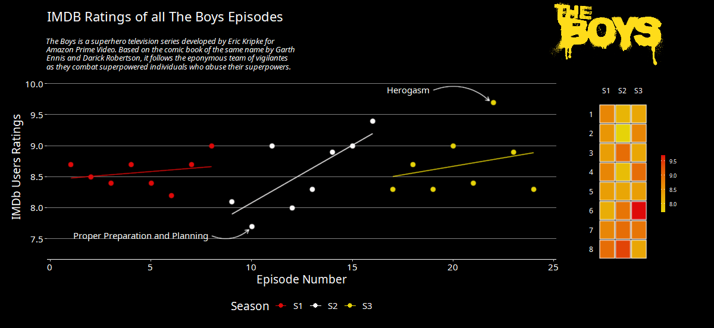

```{r setup, include=FALSE}
knitr::opts_chunk$set(echo = FALSE)
```

Esse tutorial é bem rápido e explica como realizar a obtenção de dados sobre a série de TV "The Boys" usando Python e realizar a criação de um gráfico bonito usando o pacote ggplot2 do R.  

# 1 - Tarefa inicial: web scraping no site do IMDb

A primeira tarefa é a obtenção da base de dados do site do IMDb. Nesse caso, será feita a aquisição das informações sobre a nota dos episódios de modo automático, usando a lib `selenium`.  

Primeiro importe todas as bobliotecas e os métodos a serem usados:  

```{python eval=FALSE, echo=TRUE}

import os
import time

import pandas as pd
from selenium import webdriver
from selenium.webdriver.chrome.options import Options
from selenium.webdriver.chrome.service import Service
from selenium.webdriver.common.by import By
from selenium.webdriver.support import expected_conditions as EC
from selenium.webdriver.support.ui import Select, WebDriverWait
from webdriver_manager.chrome import ChromeDriverManager

```

Em seguida, defina a endereço da página e o Xpath para o botão de musança de temporada como constates que serão usadas ao longo do tutorial:  

```{python eval=FALSE, echo=TRUE}

PAGE_URL = "https://www.imdb.com/title/tt1190634/" 
EPISODES_BUTTON = "/html/body/div[2]/main/div/section[1]/section/div[3]/section/section/div[1]/div/div[1]/a/span[1]"

```

Agora serão defindas as opções de operação do navegador, visando que a janela do Chrome abra sem prolemas:  

```{python eval=FALSE, echo=TRUE}

options = Options()
options.binary_location = os.environ.get("GOOGLE_CHROME_BIN")
options.add_argument("--no-sandbox")
options.add_argument("--disable-dev-shm-usage")
options.add_argument("--disable-gpu")
options.add_argument("start-maximized")
```

# 2 - Chegou a hora da diversão

Agora iremos solicitar ao navegador a sua abertura e que ele vá até o endereço definido previamente. Em seguida, é realizado o click no botão que define a seleção de temporadas. Por fim, então é definida um seletor de opções e a lista de temporadas da referida série de TV. A ideia é que sejam obtidos dados de cada temporada a partir de um loop baseado no tamanho da lista obtida e em seguida, para cada temporada, seja clicado o seu botão correspondente:  

```{python eval=FALSE, echo=TRUE}
driver = webdriver.Chrome(
    service=Service(ChromeDriverManager().install()), options=options
)

driver.get(PAGE_URL)

WebDriverWait(driver, 10).until(
    EC.element_to_be_clickable((By.XPATH, EPISODES_BUTTON))
).click()

selector_options = driver.find_element(By.XPATH, '//*[@id="bySeason"]')
seasons = len([x for x in selector_options.find_elements(By.TAG_NAME, "option")])

```

Agora vem a parte legal da coisa. Primeiros inicializamos uma lista com as variáveis usadas para a armazenamento das variáveis dos dados obtidos.

```{python eval=FALSE, echo=TRUE}

ratings = list()
airdates = list()
titles = list()
number = list()

```

Em seguida é definido um `for` loop meio grandinho, mas calma que explico: 

```{python eval=FALSE, echo=TRUE}

for i in range(seasons - 1):
    select = Select(driver.find_element(By.XPATH, '//*[@id="bySeason"]')) # 1
    select.select_by_index(i)
    time.sleep(10)

    # Ratings
    episodes = driver.find_elements(By.CLASS_NAME, "ipl-rating-star__rating") # 2
    for i in episodes:
        try:
            ratings.append(float(i.text))
        except ValueError:
            pass

    # Airdates
    dates_1 = driver.find_elements(By.CLASS_NAME, "airdate") # 3
    dates_2 = [i.text for i in dates_1]
    airdates.extend(dates_2)

    # Titles
    ep_names_1 = driver.find_elements(By.XPATH, "//a[@title]") # 4
    ep_names_2 = [i.text for i in ep_names_1 if i.text != ""][1::2]
    titles.extend(ep_names_2)

    # Episode Number
    ep_number_1 = driver.find_elements(By.XPATH, "//a[@title]")
    ep_number_2 = [i.text for i in ep_names_1 if i.text != ""][0::2]
    number.extend(ep_number_2)
    
```

1 - A primeira coisa é definir um seletor pra... selecionar a opção do menu dropdown com a lista de temporadas. Após a seleção, o sistema aguarda por 10 segundos (tempo da página carregar).

2 - É obtida a lista de elementos contendo as avaliações dos episódios, então é definido um `for` loop (mais um) em que é apensada à lista `ratings` cada episódio, sendo cada item a lista `episodes` convertida para o tipo `float`. Caso a conversão dê errado, nada acontece, feijoada (sim, o meme é velho).  

3 - Mesmo processo: é obtida uma lista de elementos contendo as infos das datas em que os eposódios foram ao ar, obtido o texto desses elementos, que então são adicionados à lista `airdates`.  

4 - A obtenção dos títulos e do número dos epísódios é feita de forma similar ao passo #3. A diferença aqui é que é realizado um filtro para campos em branco e a seleção em formato de lista pela notação [start:step:end].  

# 3 - Salvando os dados

Então é criado um dataframe dos pandas com as listas obtidas e em seguida ele é salvo em formato `.csv`.  

```{python eval=FALSE, echo=TRUE}
pd.DataFrame(
    {"number": number, "ratings": ratings, "airdates": airdates, "titles": titles}
).to_csv("imdb_data.csv", index=False)
```

A segunda parte consiste na criação do gráfico usando o pacote ggplot2.   

# 4 - Criação do gráfico

Os pacotes do R usados para esse gráfico são:  

```{r eval=FALSE, echo=TRUE}
library(tidyverse)
library(ggdark)
library(cowplot)
library(magick)
library(colorspace)
library(ggfx)
library(ggrepel)
library(gridExtra)
library(extrafont)
```

Então são carregadas as fontes do pacote extrafont e definido o formato de datas: 

```{r eval=FALSE, echo=TRUE}
loadfonts()

Sys.setlocale("LC_TIME", "English")

```

5 - A primeira etapa cosniste na definição da paleta de cores, leitura da base e limpeza dos dados:  

```{r eval=FALSE, echo=TRUE}

tb_cols <- c("#de0909", "#fcfafa", "#e6d309", "#999999")
raw_imdb_data <- readr::read_csv("D:/Projetos/the_boys/imdb_data.csv")

raw_imdb_data %>% 
    mutate(airdates = gsub("\\.", "", airdates)) %>% 
    mutate(airdates = as.Date(airdates, format = "%d %b %Y")) %>% 
    mutate(episode = as.integer(substring(number, 7))) %>% 
    mutate(season = as_factor(substring(number, 1, 2))) %>% 
    mutate(episode_all = 1:24) %>% 
    select(-number) -> imdb_data

```

6 - Com os dados bonitinhos, vamos criar o gráfico e apresentar os steps necessários:  

```{r eval=FALSE, echo=TRUE}
ggplot(imdb_data, aes(episode_all, ratings)) + # definição do número de episódios em x e avaliações em y
    with_blur(geom_smooth(aes(col = season), # adicção de linhas de tendência mais softs
                          formula = y ~ x,
                          method = "lm",
                          se = F,
                          size = 0.6)) +
    with_blur(geom_point( # Adição dos pontos que correspondem aos episódios soft
        aes(color = season),
        size = 2.5)
    ) +
    geom_point(aes(color = season), # Adição dos pontos que correspondem aos episódios "bruta"
        size = 1.5) +
    scale_color_manual(values = c("#de0909", "#fcfafa", "#e6d309")) + # definição das cores
    scale_y_continuous( # definição do eixo y
        name = "IMDb Users Ratings",
        limits = c(7.3, 10),
        breaks = c(7.5, 8.0, 8.5, 9.0, 9.5, 10.0)
    ) +
    xlab("Episode Number") + # rótulo do eixo x
    labs(title = "IMDB Ratings of all The Boys Episodes", # definição do título e da legenda
         subtitle = "
    The Boys is a superhero television series developed by Eric Kripke for 
    Amazon Prime Video. Based on the comic book of the same name by Garth 
    Ennis and Darick Robertson, it follows the eponymous team of vigilantes
    as they combat superpowered individuals who abuse their superpowers.",
    color = "Season") +
    dark_theme_classic() + # adicionando um tema preto
    theme(panel.grid.major.y = element_line(color = "gray50"), # definição geral do gráfico (fonte, legenda...)
          axis.line.y = element_blank(),
          text=element_text(size=14, family = "Noto Sans"),
          plot.margin = margin(0.5, 7, 0.5, 0.5, "cm"),
          plot.subtitle=element_text(size=10, face="italic", hjust=-0.03),
          axis.text = element_text(color = "white"),
          legend.position = "bottom") +
    with_blur(annotate(
        geom = "curve", x = 19, y = 9.9, xend = 21.8, yend = 9.73, # adição da seta superior
        curvature = -0.3, arrow = arrow(length = unit(2, "mm"))) 
    ) +
    annotate(geom = "text",x = 18.85, y = 9.9, label = "Herogasm", # adição da legenda da seta superior
             hjust = "right", family = "Noto Sans") +
    with_blur(annotate( # adição da seta inferior 
        geom = "curve", x = 8.0, y = 7.55, xend = 9.85, yend = 7.65, 
        curvature = 0.3, arrow = arrow(length = unit(2, "mm")))
    ) +
    annotate(geom = "text", x = 7.85, y = 7.55, # adição da legenda da seta inferior
             label = "Proper Preparation and Planning", hjust = "right", 
             family = "Noto Sans") -> my_plot # salvando o gráfico
```


7 - customizando o gráfico (mais ainda)

Adicionando a logo da série ao gráfico:

```{r eval=FALSE, echo=TRUE}

logo <- image_read(here::here("logo.png"))
ggdraw() +
    draw_plot(my_plot) +
    draw_image(logo, x = 0.35, y = 0.4, scale = .2) -> plot1

```

8 - Criando o gráfico de "quadrinhos" heatmap: 

```{r eval=FALSE, echo=TRUE}
imdb_data %>% 
    ggplot(aes(season, episode, label = ratings)) + # temporadas no x e episódios no y
    with_blur(geom_tile(aes(fill = ratings), # adicionando o heatmap
              color = "white",
              lwd = 0.4,
              linetype = 1,
              width=0.94,
              height=0.94)) +
    scale_fill_gradient(low = tb_cols[3], high = tb_cols[1]) + # definindo as cores
    scale_y_continuous(breaks = c(1, 2, 3, 4, 5, 6, 7, 8), # customizando o eixo y
                       trans = "reverse") +
    scale_x_discrete(position = "top") + # colocando o eixo x no topo
    xlab("Season") + # rótulo do eixo x
    ylab("Episodes") + # rótulo do eixo y
    guides(fill = guide_colourbar(barwidth = 0.35, # definindo a espessura da grade
                                  barheight = 5)) +
    theme(axis.line = element_blank(), # definição geral do gráfico (fonte, legenda...)
          axis.ticks = element_blank(),
          text = element_text(family = "Noto Sans"),
          aspect.ratio=10/3,
          legend.title=element_blank(),
          legend.text=element_text(size=7, colour = "white"),
          panel.background = element_rect(fill='transparent'),
          plot.background = element_rect(fill='transparent', color=NA),
          panel.grid.major = element_blank(), #remove major gridlines
          panel.grid.minor = element_blank(), #remove minor gridlines
          legend.background = element_rect(fill='transparent'), #transparent legend bg
          plot.margin = margin(0.0, 0, 0.0, 0.0, "cm"),
          axis.text = element_text(color = "white"),
          axis.title = element_blank()) -> plot2 # # salvando o gráfico

```

9 - Unindo os dois gráficos

Após preparar os dois gráficos, então é feita a sua união e definição da localização de cada um no plot:

```{r eval=FALSE, echo=TRUE}
ggdraw() +
    draw_plot(plot1, 0, 0, 1, 1) +
    draw_plot(plot2, 0.79, 0.19, 0.2, 0.55)

```
PS: a definição do tamanho  de salvamento pode afetar a apresentação dos elementos nos gráficos.  

  

# Conlusão

Opa, mais um tutorial para a lista! Espero que tenha gostado e até a próxima!  

