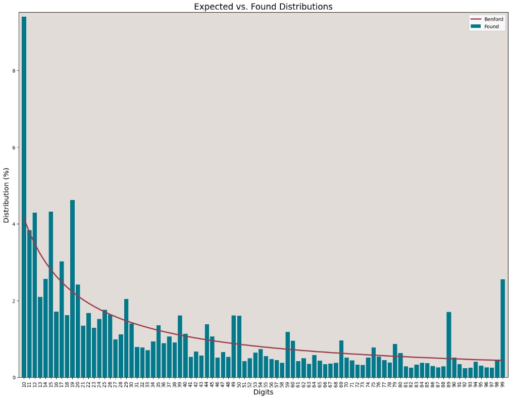

```{r setup, include=FALSE}
knitr::opts_chunk$set(echo = FALSE)
```

O objetivo desse artigo é explicar como realizar a seleção de amostras em processos de auditoria para identificação de fraudes usando a Lei de Benford em Python.  

# Lei de Benford
Essa é uma [lei](https://en.wikipedia.org/wiki/Benford%27s_law) curiosa: ela é uma observação de que em muitos conjuntos de dados numéricos, o dígito inicial provavelmente será pequeno (e.g. 1, 2...). Em séries de registros que obedecem à lei, o número 1 aparecerá como o primeiro dígito significativo em cerca de 30% das vezes, enquanto 9 aparece como o primeiro dígito significativo em menos de 5% das vezes.  

Sua aplicação se dá em diversos campos, sendo o mais comum na área de identificação de red flags sobre transações financeiras. Entretanto, seu uso possui [limitações](https://www.fraud-magazine.com/article.aspx?id=203), ainda que seja legamente aceita como evidência em casos criminais nas esferas locais, estaduais e federais dos EUA, de acodo com a Information Systems Audit and Control Association ([ISACA](https://www.isaca.org/resources/isaca-journal/past-issues/2011/understanding-and-applying-benfords-law)).  

# Aplicação

A Lei de Benford é utilizada para a identificação de anomalias em séries de dados, não sendo bala de prata para a identificação de fraudes, ainda que seu uso seja de grande valia e um direcionador.  

Neste caso em questão, utilizarei a biblioteca [`benford_py`](https://github.com/milcent/benford_py) do Python para a identificação de possíveis fraudes no dataset [Credit Card Fraud Detection](https://www.kaggle.com/datasets/mlg-ulb/creditcardfraud). Esse dataset trás transações realizadas por clientes europeus no ano de 2013, tendo ao todo 284.807 registros, sendo fraudes 492 desses dados. A ideia aqui é simular uma possível seleção de transações para inspeção mais rigorosa, dado o tamanho elevado da base da dados. Assim, o objetivo é realizar a avaliação da base de dados usando a Lei de Benford e então definir a seleção de amostras de determinados grupos de números, caso sejam observadas anomalias.  

# Identificação de Red Flags

Inicialmente será feito o carregamento da base e a seleção de registros:

```{python eval=FALSE, echo=TRUE}

import benford as bf
import pandas as pd


fraud_df = (pd.read_csv("creditcard.csv")
 .query('Amount >= 1')
 .assign(Amount_Str=lambda x: x.Amount.astype(str).str.replace('.', '', regex=True))
)
```

Além de serem filtradas apenas transações com Montantes acima de € 1,00, também foi adicionada uma coluna com os valores dos Montantes em formato *string* para facilitar a manipulação dos dados. O filtro dos valores foi pelo fato de que a Lei se dá apenas para valores entre 1-9. Em seguida, foi aplicado o método `bf.first_digits` usando a coluna `Amount` do dataset para se obter o comportamento dos dados das movimentações. Nesse caso, foram agrupados os registros a partir dos 2 primeiros dígitos dos Montantes:  

```{python eval=FALSE, echo=TRUE}
bf.first_digits(fraud_df.Amount, digs=2)

```

O resultado pode ser observado na imagem abaixo:  



Nesse caso, o direcionamento para seleção das amostras será feito de forma visual, entretanto para uma avaliação mais criteriosa pode-se optar por um teste estatístico, como o de Kolmogorov-Smirnov por exemplo. Nesse caso, foi possível observar que os montantes que se iniciam com 10, 19, 89 e 99 fogem de forma drástica da distribuição teórica dos dados, indicando possíveis anomalias com esses valores. A partir dessa informação, pode proceder com uma análise mais direcionada para a obtenção das amostras.  

# Obtenção das Amostras

Para aquisição dos registros a serem amostrados, a base de dados será filtrada usando os valores indicados na análise visual do gráfico de distribuição:  

```{python eval=FALSE, echo=TRUE}
(fraud_df
  .query("Amount_Str.str.startswith(tuple(['99', '89', '19', '10']))")
  )
  
```

A base de dados então foi reduzida a 48.991 linhas. Ainda é uma base grande (268.003 - lembre-se que foi feito um filtro dos valores abaixo de € 1,00 no dataset), porém de tamanho menor que a inicial. A partir daqui podem ser usadas outras técnicas e inteligências direcionadoras para uma melhor definição do grupo a ser amostrado, como selecionar os valores de Montantes que mais se repetem na série.  

# Efetividade da Lei de Benford
A essa altura você deve estar pensando: `sim, mas quem me garante que essa técnica é efetiva?`  
Como o dataset, diferente da vida real, possui uma coluna `Class` indicando fraudes (1) e não-fraudes (0), podemos investigar o quanto os valores identificados ('99', '89', '19', '10') correspondem a fraudes na base completa:  

```{python eval=FALSE, echo=TRUE}
(fraud_df
  .query("Amount_Str.str.startswith(tuple(['99', '89', '19', '10'])) and \
         Class == 1")
  )
```

No total, os valores iniciados em 10, 19, 89 e 99 correspodem a 166 registros da base de dados. Esse valor corresponde à aproximadamente 40% de todas as fraudes identificadas (424 após filtragem inicial). Esse resultado indica que a utilização da Lei de Benford para identificar possíveis fraudes em uma base de dados é uma estratégica efetiva e que pode otimizar o trabalho de auditoria, tornando a definiçao de amostras mais dinâmica.  

Até a próxima!  