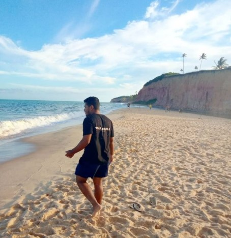

```{r setup, include=FALSE}
knitr::opts_chunk$set(echo = FALSE)

# Learn more about creating websites with Distill at:
# https://rstudio.github.io/distill/website.html

```

{width=50%}

## Education:
 
MSc Forestry Sciences, State University of Southwestern Bahia, 2021.  

BSc in Forestry, State University of Southwestern Bahia, 2017.  

My [resumé](resume.pdf).  